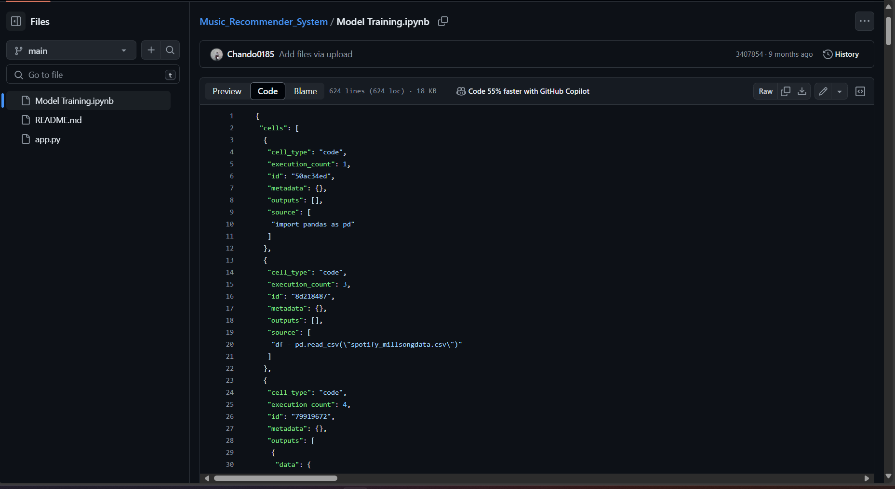

# **Why ipynb file is looking like json??**
If u open a ipynb file in github and it looks like this👇

then follow the given steps:
1. Copy all the code
2. Create a .md file, paste all the code in that file

3. Rename the .md file to .ipynb

So, you have got your .ipynb file

