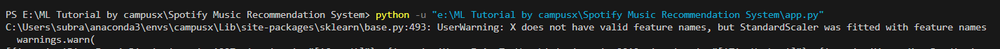

# **Remove Warnings**
If u get any kind of warning about which u have no no idea how to deal with it just as given below
 
 then use the given syntax below to remove any such warning
```python []
import warnings
warnings.filterwarnings("ignore")
```